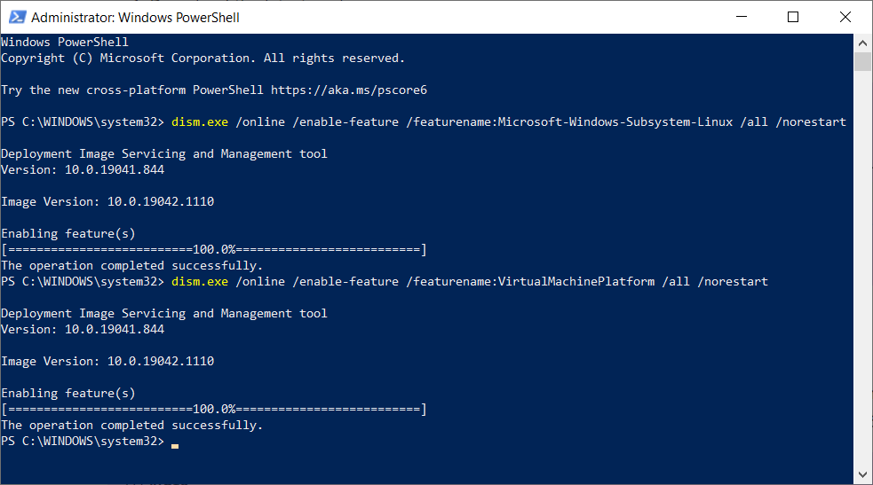
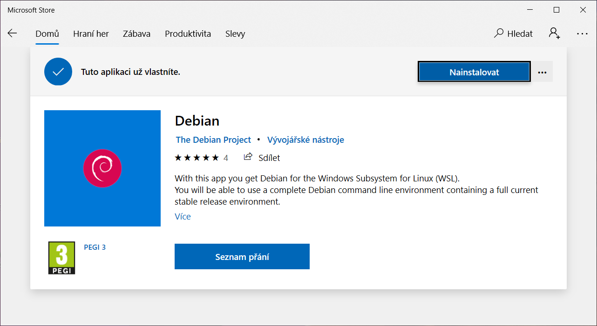
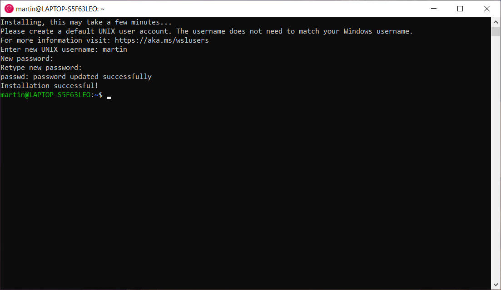
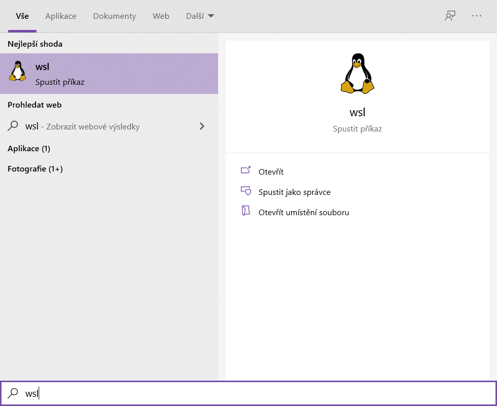

I když se jedná o workshop o Linuxu, pravděpodobně většina z vás přichází s operačním systémem Windows 10. Abychom však mohli pracovat s linuxovou příkazovou řádkou, potřebujeme ji mít k dispozici na našem počítači. Způsobem jak toho můžeme snadno dosáhnout je použít vestavěnou funkcionalitu operačního systému Windows 10 s názvem _Windows Subsystem for Linux (WSL)_.

**POZOR!** Je nezbytné mít nejaktuálnější updatované Windows 10. Na starších Windows než Windows 10 není funkcionalita _WSL_ přítomna.

## Instalace WSL na Windows 10
Budeme následovat oficiální návod na [webu Microsoftu](https://docs.microsoft.com/en-us/windows/wsl/install-win10) a nainstalujeme si nejvyšší verzi _WSL_.

### Klíčové body instalace
1. Zapněte funkcionalitu WSL a virtualizace (Step 1 a 3 v oficiálním návodu)

    {.fig .fig-100}

1. Restartujte počítač!
1. Stáhněte s nainstalujte WSL update Linuxového jádra (Step 4)
1. Nastavte WSL 2 jako výchozí verzi (Step 5)
1. Nainstalujte linuxovou distribuci z Microsoft Store (např. Debian a kompletní distribuce, která je zároveň nejmenší z nabízených a stažení nebude trvat dlouho)

    {.fig .fig-100}

1. Po prvním spuštění distribuce vyžaduje vytvoření uživatele s heslem.

    **POZOR!** Psaní hesla v linuxovém terminálu neposkytuje žádnou vizuální odezvu (žádné `*` nebo •). To, že se nic nezobrazuje, když zadáváte heslo, je účel.

    {.fig .fig-100}

1. Od teď již budete moci kdykoliv spustit WSL zadáním tohoto příkazu v nabídce Start

{.fig .fig-100}

## MacOS a Linux

Pokud používáte Apple nebo už máte nainstalován Linux, stačí najít ve svém prostředí aplikaci _Terminal_. Nemůžete-li ji najít přímo, zkuste použít vyhledávání.

